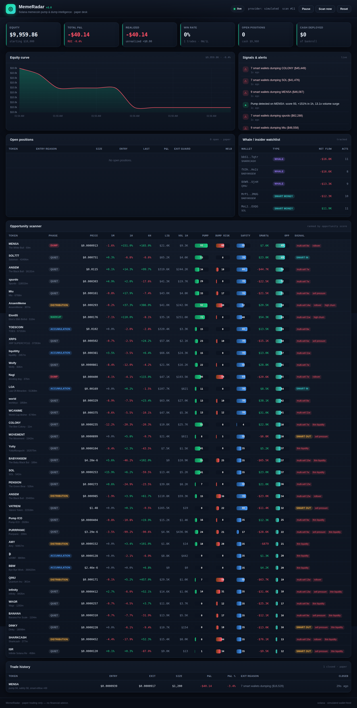

# Trenchr 📡

**A paper-trading bot that hunts Solana memecoin pumps, flags pump-and-dumps,
tracks whale / insider wallets, and sells *before* the dump — all on a live,
professional dashboard. Starts with a $10,000 paper bankroll. No real money.**



> ⚠️ **Paper trading & educational only.** This places **no real orders** and is
> **not financial advice.** Memecoins are extremely high-risk. Nothing here can
> guarantee profit — it is a risk-management and signal-detection toolkit.

---

## What it does

| Goal you asked for | How Trenchr does it |
|---|---|
| **Find coins about to pump** | Scans trending Solana memecoins and scores each with a **pump score** (price acceleration + volume surge + buy/sell imbalance + youth). |
| **Flag pump & dumps** | A **dump-risk** score detects distribution: rollovers after a run, rising sell pressure, volume fading at the highs. Tokens are labelled by **market phase** (accumulation → markup → distribution → dump). |
| **Insider / whale / smart-money wallets** | A wallet-intelligence layer classifies wallets as **whale / insider / smart-money / retail**, tracks their net flow, and surfaces a live watchlist. |
| **Sell before losing everything** | A layered exit ladder: **stop-loss**, **trailing stop** (locks in profit, bails before the crash), **take-profit**, **dump-risk spike**, and **momentum reversal**. |
| **"Sell when multiple wallets sell — but only when sure"** | A **confirmed coordinated-sell** signal fires *only* when ≥ N distinct tracked smart wallets dump the same token inside a time window **and** the combined size is material. When it fires, open positions are exited immediately. |
| **Start with $10,000 paper** | The portfolio starts at exactly `$10,000` and simulates fills with slippage + fees. |
| **Professional dashboard** | A dark, real-time web dashboard: equity curve, KPIs, open positions, opportunity scanner, signals feed, whale watchlist, and trade history. |

---

## Quick start

```bash
# 1. install dependencies (Python 3.10+)
pip install -r requirements.txt

# 2. run it
python run.py

# 3. open the dashboard
#    http://127.0.0.1:8000
```

That's it. With **no API keys** it already works end-to-end using the free,
key-less [DexScreener](https://dexscreener.com) API for live Solana market data.

### Run it 24/7 (DigitalOcean)

A scanner is most useful running around the clock. See **[DEPLOY.md](DEPLOY.md)**
for a step-by-step DigitalOcean Droplet + Docker Compose setup (with a persistent
data volume, optional HTTPS, and a dashboard login). TL;DR on a Docker host:

```bash
cp .env.example .env      # set DASHBOARD_PASSWORD
docker compose up -d --build
```

> **Dashboard login:** set `DASHBOARD_PASSWORD` in `.env` before exposing the
> dashboard publicly — it gates the controls (including **Reset**). Unset = no
> login, which is fine for localhost-only use.

### Optional: real on-chain wallet data

Token-level signals are 100% real out of the box. To make the **whale-holder
concentration** real (instead of estimated), add a free
[Helius](https://helius.dev) key:

```bash
cp .env.example .env
# then set HELIUS_API_KEY=...   (and restart)
```

See **“What's real vs simulated”** below for an honest breakdown.

---

## How the brain works

```
 ┌─────────────┐   ┌───────────┐   ┌──────────────┐   ┌───────────┐   ┌────────────┐
 │ DexScreener │ → │ Detector  │ → │ Wallet Intel │ → │ Strategy  │ → │ PaperTrader│
 │ (discovery  │   │ pump/dump │   │ whales/      │   │ entry +   │   │ $10k book, │
 │  + enrich)  │   │ /safety   │   │ multi-sell   │   │ exit ladder│  │ P&L, curve │
 └─────────────┘   └───────────┘   └──────────────┘   └───────────┘   └────────────┘
                          └──────────────┴── Scanner loop (every ~25s) ──┘
                                         ↓
                              FastAPI + WebSocket → Dashboard
```

### Entry logic
A token is bought only when **all** gates pass: strong pump score, acceptable
dump risk, structural safety (liquidity / age / churn), and net smart-money
inflow — and never while a confirmed coordinated sell is active.

**Cabal-buy** is a second entry path: when a **known cabal** (a recurring group)
has ≥ N members buy the *same* coin inside a window **and** the coin clears a
quality gate (safety, dump-risk, not distributing), Trenchr opens a position
and records *which* cabal and wallets triggered it (shown in **Trade Specs**).
Tunable in `config.yaml` (`cabal_buy_*`); respects Pause and the position cap.

### Exit logic — *“sell before the dump”*
Evaluated worst-case first, every scan, for every open position:

1. **Stop-loss** — hard floor (default −18%).
2. **Confirmed multi-wallet sell** — ≥ 3 smart wallets dumping ≥ $15k → exit now.
3. **Dump-risk spike** — detector says distribution is starting → exit.
4. **Trailing stop** — once +12% in profit, give back at most 14% from the peak.
5. **Take-profit** — absolute target (default +45%).
6. **Momentum reversal** — clear roll-over while in profit → bank it.

Every entry/exit posts an explained signal to the dashboard feed.

---

## Configuration

Everything is tunable in [`config.yaml`](config.yaml) — bankroll, scan interval,
position sizing, all entry/exit thresholds, and the wallet-intelligence
parameters (whale size, the coordinated-sell window and minimum wallet count,
etc.). Secrets come from `.env`.

A few of the most useful knobs:

```yaml
starting_balance_usd: 10000   # paper bankroll
take_profit_pct: 0.45         # lock profit at +45%
stop_loss_pct: 0.18           # hard floor at -18%
trailing_stop_pct: 0.14       # give back at most 14% off the peak
multi_sell_min_wallets: 3     # "only when sure" — N smart wallets selling
multi_sell_min_usd: 15000     # ...and a material combined size
auto_trade: true              # let the strategy open/close paper positions
```

---

## Dashboard

The dashboard has a **left sidebar** to navigate between views, with global
controls (pause / scan / reset) tucked into the sidebar foot. A persistent
**Equity · Cash · P&L** strip sits in the top-right corner of every tab. Click
any **open position** (or any **Launchpad coin**) to open a **profile** — the
live DexScreener chart plus the coin's full specs, and for a held position your
size / entry / P&L with quick-sell.

### 💱 Trade
**Manual paper trading.** Buy any scanned coin (pick from the dropdown or click a
row in the opportunity scanner, set a USD amount or use the $50/$100/$250/$500
quick buttons) and **sell** any position 25% / 50% / 100%. Fills use the live
price with slippage + fees. This tab also holds open positions and the
opportunity scanner. Auto-trading and manual trading coexist — pause auto for
full manual control.

### 📒 Trade Specs
**Every closed trade gets a profile.** A summary strip (closed trades, win rate,
realized P&L, avg ROI / profit factor, best & worst trade) sits above a grid of
**trade cards** — each shows win/loss, P&L, ROI, size, hold time and a one-line
"why we bought". Filter (wins / losses / auto / manual), search by symbol, and
sort by recency / P&L / ROI. **Click any trade** for the full profile: the result
(P&L, ROI, entry→exit price, hold), the **"why we bought"** evidence captured at
entry — pump/dump/safety/opportunity scores, market phase, the exact signals and
flags, smart-money inflow and whale/insider counts, and the **named wallets that
were flagged on that coin** (click through to each wallet) — plus the exit reason.
The entry context is snapshotted at buy time, so the record reflects what the bot
actually saw, not the coin's state today.

### 📊 Dashboard (Overview)
A decluttered at-a-glance view: the KPI strip, the equity curve, and the live
signals feed.

| Panel | Shows |
|---|---|
| **KPI strip** | Equity, total P&L, realized vs unrealized, win rate, open positions, cash deployed. |
| **Equity curve** | Live paper-portfolio value over time. |
| **Signals & alerts** | Pumps, dump warnings, whale buys, coordinated sells, and every entry/exit with its reason. |

Open positions and the opportunity scanner live on the **Trade** tab; closed
trades and their profiles on the **Trade Specs** tab.

### 🚀 Launchpad
**Catch pump.fun coins in their first minutes.** A live websocket
([PumpPortal](https://pumpportal.fun), free) streams *every* new pump.fun launch
and every graduation; each fresh coin is enriched with live DexScreener data
(which covers new mints within seconds) and scored with a **moonshot score** —
early buy velocity, buy/sell pressure, price impulse and forming liquidity,
*minus* dev-rug and distribution signals. The board is a live grid of fresh coins
(age in seconds, score, market cap, liquidity, 5m change, creator) you can buy
into with one click.

- **Real auto-discovered wallets.** Creator wallets are tracked across launches:
  how many coins they've shipped, how many gained traction or **graduated**, and
  their hit-rate. Serial ruggers and serial winners both surface over time. This
  is **real, free** on-chain wallet intelligence.
- **🕵️ Smart buyers** (with a funded `PUMPPORTAL_API_KEY`). The per-trade stream
  reveals the wallets *buying* each coin early; each is **smart-scored** by how
  reliably the coins it apes into go on to win (traction / graduation), plus an
  accumulator-vs-dumper bias and net SOL flow. This is the real "find the
  insider wallets that get in before the pump" capability. Without a key the
  panel shows a one-step unlock note; creator discovery above stays fully free.
- **💸 Spray mode** (opt-in): *"put a small amount in each — it either explodes or
  goes to zero."* Sprays a tiny capped paper bet ($25 by default) across the
  strongest fresh candidates, then runs a fast exit ladder: bank at a big
  multiple (3×), hard stop (−55%), or bail if it stalls. All paper, capped
  (max positions + max total), and every bet is tagged so it shows up with its
  reasoning in **Trade Specs**. Toggle it from the tab; tune it in `config.yaml`.

> Liquidity note: DexScreener often reports `$0` liquidity for a coin in its
> first minutes (not yet indexed), so the score floors liquidity with the coin's
> **bonding-curve SOL reserve** — a streaming pump.fun coin always has a real,
> tradeable market.

### 📈 Live Charts
Every scanned coin gets a **profile** (full DexScreener stats — price, all
change/volume windows, txns, liquidity/mcap/FDV, age, rug-authority status —
plus Trenchr's pump/dump/safety/opportunity scores and reasons) with a toggle
to the **full DexScreener chart** (TradingView-powered candles, timeframes,
indicators). Each coin in the list has a 📈 button to jump straight to its
chart, or paste any pair/token address.

### 👛 Wallets
Organised into sub-tabs:
- **🚀 Loadouts** — young coins a strong team is accumulating (see below).
- **👛 Wallets** — one searchable, filterable table of every tracked wallet:
  sort by **richest→poorest**, **buy amount**, **date added**, win rate, or
  activity; filter by type; **search by address**.
- **👥 Cabals** — clusters of wallets that repeatedly trade the *same* coins.
- **📦 Bundles** — coordinated multi-wallet **buys** of the same coin, tiered by
  timing: **<1 min = synchronized** (strong), **<20 min = coordinated**,
  **same-day = minor**. Also pushed as alerts. (Most precise with real wallet
  data; the simulated feed flags frequently because its smart wallets are very
  active.)

- **🚀 Fresh loadouts** (top of the tab): young coins where a *strong team* of
  good wallets is accumulating early — the bullish, forward-looking inverse of
  the dump detector. Each shows a loadout score, the team, and the cabal behind
  it. Recency-ranked so it stays current.
- **Click any wallet** anywhere → a **profile** with holdings, PnL, win rate,
  and a modelled "career" equity chart. **Click any cabal** → a profile with
  members, combined stats, what they're *currently loading*, and their track
  record. *(PnL/holdings/career are modelled from market pressure and clearly
  labelled — real per-wallet trade history needs a paid indexer; current SPL
  holdings can be made real with a Helius key.)*

### 📣 Influencers
A curated watchlist of X/Twitter influencers / KOLs and their wallets, with what
each is currently trading. Because no API reliably maps a handle → wallet, this
list is **manual**: edit [`influencers.yaml`](influencers.yaml) to add verified
addresses. Ships with clearly-labelled demo entries.

Controls: **Pause/Resume** auto-trading, **Scan now**, and **Reset** the paper
portfolio back to $10,000.

---

## What's real vs simulated (honest breakdown)

| Component | Source |
|---|---|
| Token discovery, prices, volume, txns, liquidity, price-change windows | **Real** — DexScreener (free, key-less). |
| Pump / dump / safety scoring, phase labels | **Real** — computed from the above. |
| Paper fills, fees, slippage, P&L, equity curve | **Real** simulation against live prices. |
| Whale-holder **concentration** | **Real** with `HELIUS_API_KEY` (`getTokenLargestAccounts`); otherwise estimated from market structure. |
| Per-wallet **buy/sell events** (the named whale/insider wallets) | **Simulated** — a stable per-token roster whose actions are driven by the token's *real* buy/sell pressure and price action. Clearly labelled `simulated` in the UI. Live per-swap attribution needs a streaming indexer (a planned v2). |
| **Launchpad** — new pump.fun coins, creators, graduations | **Real** — live PumpPortal websocket (free) + DexScreener enrichment. Moonshot scoring and **creator** wallet discovery are real. |
| Launchpad **per-buyer** wallet discovery | **Real with a funded `PUMPPORTAL_API_KEY`** (per-trade stream); otherwise discovery is per-creator. |
| Spray-mode fills & P&L | **Real** simulation against live prices (paper). |

The point: market signals and trade simulation are real; the individual wallet
*identities* are synthesised (and labelled as such) so the coordinated-sell
logic is fully demonstrable without paid streaming infrastructure.

---

## Tests

```bash
python -m pytest -q
```

Covers the detector scoring, the paper trader (fills/fees/persistence), and the
full entry + exit strategy ladder.

---

## Project layout

```
run.py                     # entry point: python run.py
config.yaml                # all tunables
app/
  config.py                # config loader (yaml + env)
  models.py                # domain dataclasses
  database.py              # SQLite persistence
  main.py                  # FastAPI app: REST + WebSocket + static
  data/
    dexscreener.py         # live Solana market data
    wallets.py             # Helius (real) + simulated wallet providers
    pumpportal.py          # live pump.fun new-coin/migration stream + creators
  engine/
    detector.py            # pump/dump/safety scoring (pure, tested)
    wallet_intel.py        # whale/insider aggregation + coordinated-sell
    launchpad.py           # moonshot scoring + spray bets (pure score, tested)
    strategy.py            # entry gating + exit ladder (pure, tested)
    paper_trader.py        # $10k book, fills, P&L, equity curve
    scanner.py             # the loop that ties it together
  web/static/              # dashboard (index.html, app.js, styles.css)
tests/                     # pytest suite
```
